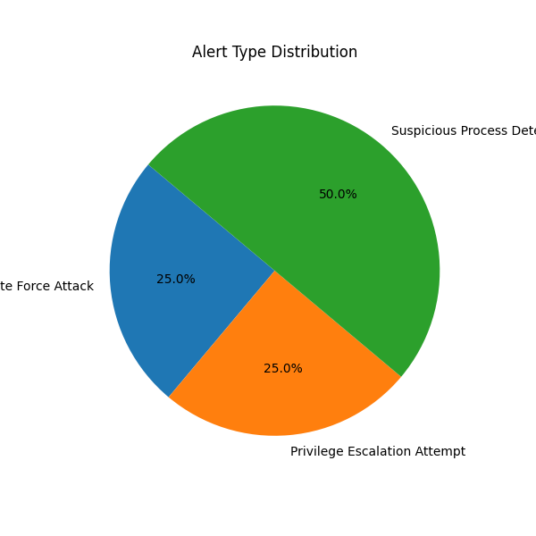
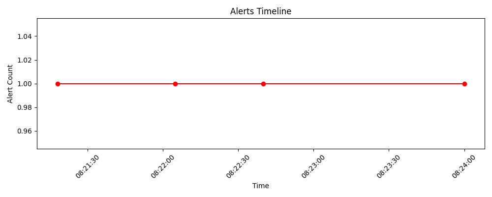

📌 Project: Threat Pattern Analyzer with Alert Intelligence Visualizer
💼 Day 5 – SOC Job Attack Mode
🔒 A real-time log analysis and alert visualization dashboard for threat detection in security operations.

🧠 Overview
This project parses system security logs to detect suspicious behavior such as:

🚨 Brute-force login attempts

🔐 Privilege escalation

🛠️ Suspicious process execution

All alerts are visualized in a stunning dark-themed web dashboard with animated charts and live data table.

| Feature                | Description                                                |
| ---------------------- | ---------------------------------------------------------- |
| 🔍 Log Parser          | Parses raw logs into structured events                     |
| ⚠️ Threat Detector     | Flags brute force, escalation, suspicious processes        |
| 📊 Alert Visualizer    | Pie + Timeline charts using Matplotlib                     |
| 🌐 Flask Web Dashboard | Animated dark theme UI to showcase alerts                  |
| 💡 Static API Route    | `/api/alerts` for future expansion (e.g., XDR integration) |

📸 Screenshots
🔶 Alert Dashboard – Professional UI

Day05_Threat_Pattern_Analyzer_Web/

├── app.py

├── core/

├── output/

│   └── alerts.json

├── static/

│   ├── css/

│   └── images/

├── templates/

│   └── dashboard.html

# Install dependencies
pip install flask matplotlib

# Run the Flask app
python app.py

Open in browser:
👉 http://127.0.0.1:5000/

{
  "timestamp": "2025-07-12T08:21:18",
  "alert_type": "Brute Force Attack",
  "ip": "192.168.1.5",
  "description": "3 or more failed login attempts detected from IP 192.168.1.5",
  "severity": "high"
}

📌 Author
Sanjai R – 100 Days of SOC Engineering
🔗 LinkedIn - https://www.linkedin.com/in/sanjai-r-60676126b
🔗 GitHub   - https://github.com/Mrsanjai

